# 컬렉션 프레임웍
1. **JDK1.2 이전까지**는 Vector, Hashtable, Properties와 같은 컬렉션 클래스들은 서로 다른 각자의 방식으로 처리해야 했다.
2. **JDK1.2 부터** 컬렉션프레임웍이 등장하면서 다양한 종류의 컬렉션 클래스가 추가되었고, 모든 컬렉션 클래스를 표준화된 방식으로 다룰 수 있도록 체계화됨.
<br> - 다수의 데이터를 쉽게 처리할 수 있는 표준화된 방법을 제공하는 클래스들

# 컬렉션
- 다수의 데이터, 즉 데이터 그룹을 의미

# 프레임웍
- 표준화, 정형화된 체계적인 프로그래밍 방식

# 컬렉션 클래스
- 다수의 데이터를 저장할 수 있는 클래스

# 컬렉션 프레임웍의 핵심 인터페이스 (List, Set, Map)
1. **List**: 순서가 있는 데이터의 집합. 데이터의 중복을 허용한다.
2. **Set**: 순서를 유지하지 않는 데이터의 집합. 데이터의 중복을 허용하지 않는다.
3. **Map**: 키(key)와 값(value)의 쌍(pair)으로 이루어진 데이터의 집합.
 순서는 유지되지 않으며, 키는 중복을 허용하지 않고, 값의 중복을 허용한다.
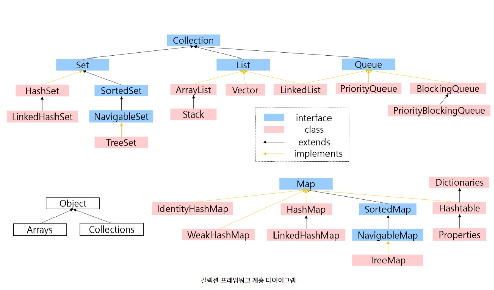
<br> - Vector, Hashtable, Properties와 같은 클래스들은 컬렉션 프레임웍이 만들어지기 이전부터 존재하던 것이기 때문에 컬렉션 프레임웍의 명명법을 따르지 않는다.
<br> - Vector나 Hashtabler과 같은 기존의 컬렉션 클래스들은 호환을 위해, 설계를 변경해서 남겨두었지만 **가능하면 사용하지 않는 것이 좋다.**

# 동기화
1. 멀티쓰레드 프로그래밍에서는 하나의 객체를 여러 쓰레드가 동시에 접근할 수 있기 때문에 데이터의 일관성을 유지하기 위해서는 동기화가 필요하다.
2. Vector와 Hashtable과 같은 구버전(JDK1.2 이전)의 클래스들은 자체적으로 동기화 처리가 되어있는데, 멀티쓰레드 프로그래밍이 아닌 경우에는 불필요한 기능이 되어 성능을 떨어트리는 요인이 된다.
3. ArrayList와 HashMap과 같은 컬렉션은 동기화를 자체적으로 처리하지 않고 필요한 경우 java.util.Collections클래스의 동기화 메서드를 이용해서 동기화처리가 가능하도록 변경되었다.

```java
-- 12장 쓰레드 영역에서 자세히 다루기 때문에 그냥 이런게 있다 정도만..

static Collection synchronizedCollection(Collection c)
static List synchronizedList(List l)
static Map synchronizedSet(Set s)
static Set synchronizedMap(Map m)
static SortedMap synchronizedSortedSet(SortedSet s)
static SortedSet synchronizedSortedMap(SortedMap m)

ex)
List list = Collections.synchronizedList(new ArrayList(....));
```

# Vector와 ArrayList
1. ArrayList는 기존의 Vector를 개선한 것으로 구현원리와 기능적으로 동일 
2. List인터페이스를 구현하므로, 저장순서가 유지되고 중복을 허용한다. 
3. 데이터의 저장공간으로 배열을 사용한다.(배열기반) 
4. Vector는 자체적으로 동기화처리가 되어 있으나 ArrayList는 그렇지 않다. 
<br> - **Vector보다는 ArrayList를 사용하는것이 좋다.**   
<br> * 기본 예제  
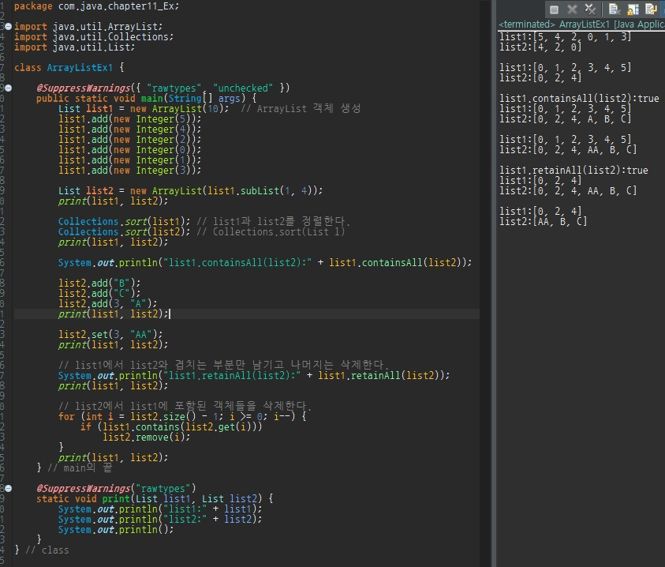   
<br> * 긴 문자열 데이터를 원하는 길이로 잘라서 ArrayList에 담은 다음 출력하는 예제  
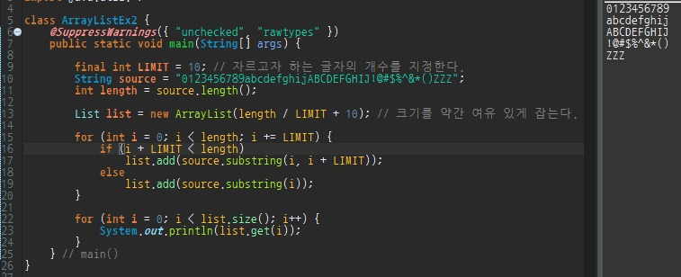  

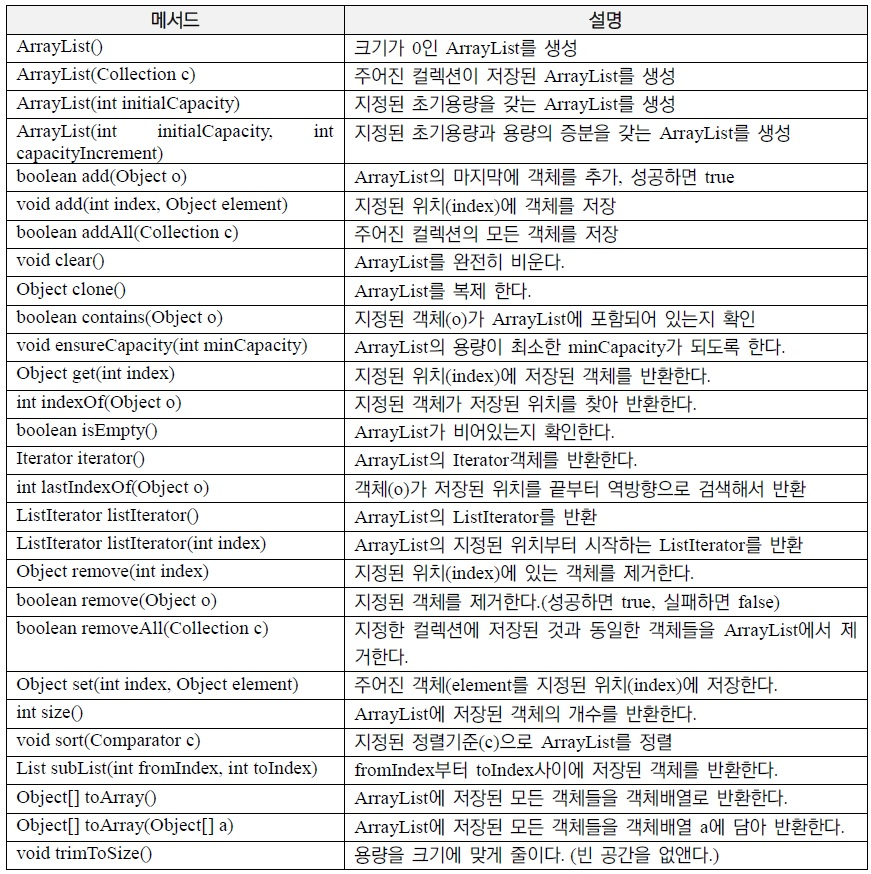


# Deep copy vs. Shallow copy
1. Deep copy(깊은 복사): 같은 내용의 새로운 객체를 생성. 원본의 변화에 복사본이 영향을 받지 않는다.
2. Shallow copy(얕은 복사): 참조변수만 복사. 원본의 변화에 복사본이 영향을 받는다.  

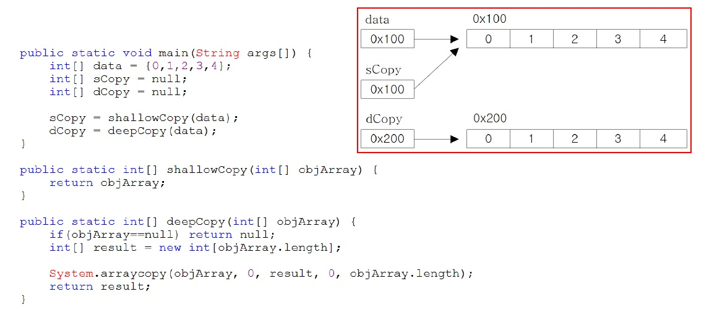  

# ArrayList의 단점 (배열의 단점)
- 배열은 구조가 간단하고 데이터를 읽어오는 데 걸리는 시간(접근시간, access time)이 가장 빠르다는 장점이 있지만 단점도 있다.
1. **크기를 변경할 수 없다.**
<br> - 크기를 변경해야 하는 경우 새로운 배열을 생성하고 데이터를 복사해야 한다.(비용이 큰 작업) 
<br> - 크기 변경을 피하기 위해 충분히 큰 배열을 생성하면, 메모리 낭비가 심해진다.  
2. **비순차적인 데이터의 추가, 삭제에 시간이 많이 걸린다.**
<br> - 그러나, 순차적인 데이터 추가(마지막에 추가)와 순차적으로 데이터를 삭제하는 것(마지막에서부터 삭제)은 빠르다. 
<br> - 데이터를 추가하거나 삭제하기 위해, 많은 데이터를 옮겨야 한다.  

# LinkedList (더블 링크드 리스트, 더블 서큘러 링크드 리스트 뭔말이야 싀부레)
- 배열과 달리 LinkedList는 불연속적으로 존재하는 데이터를 연결(Link)

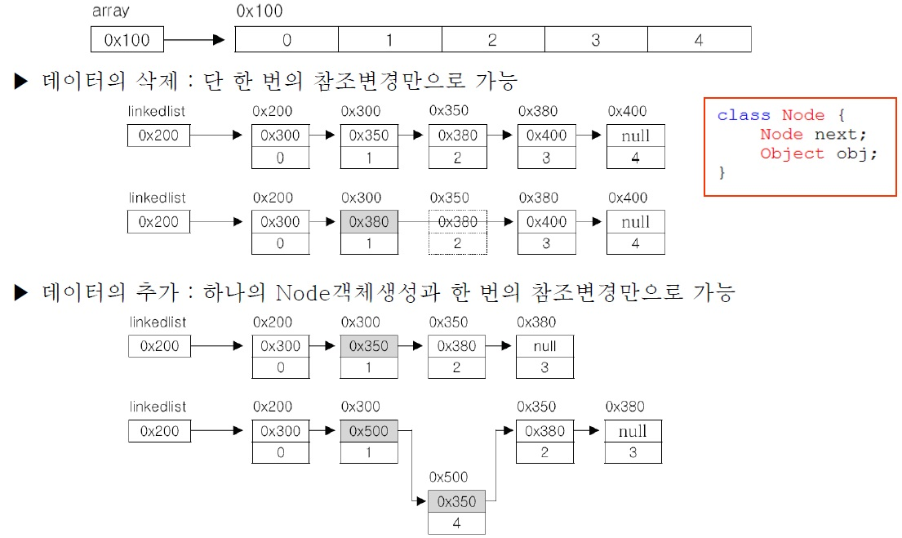  
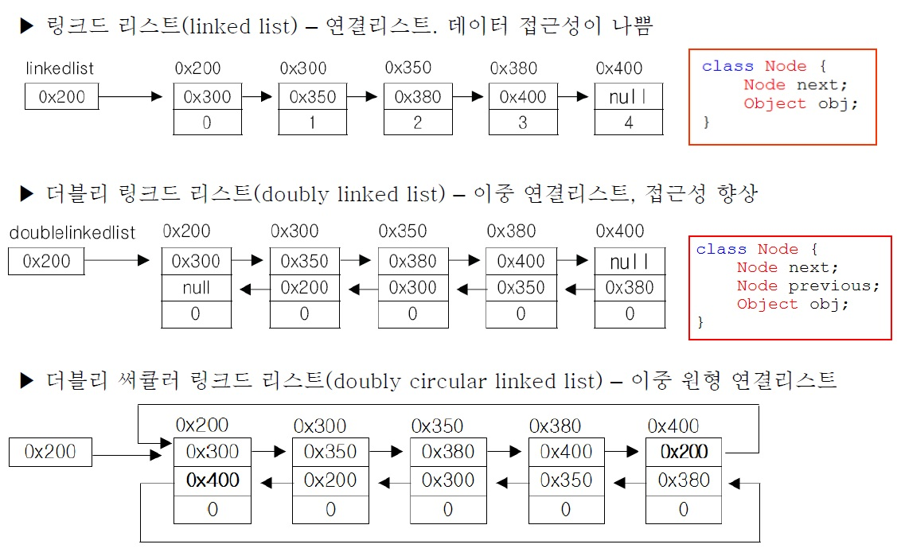

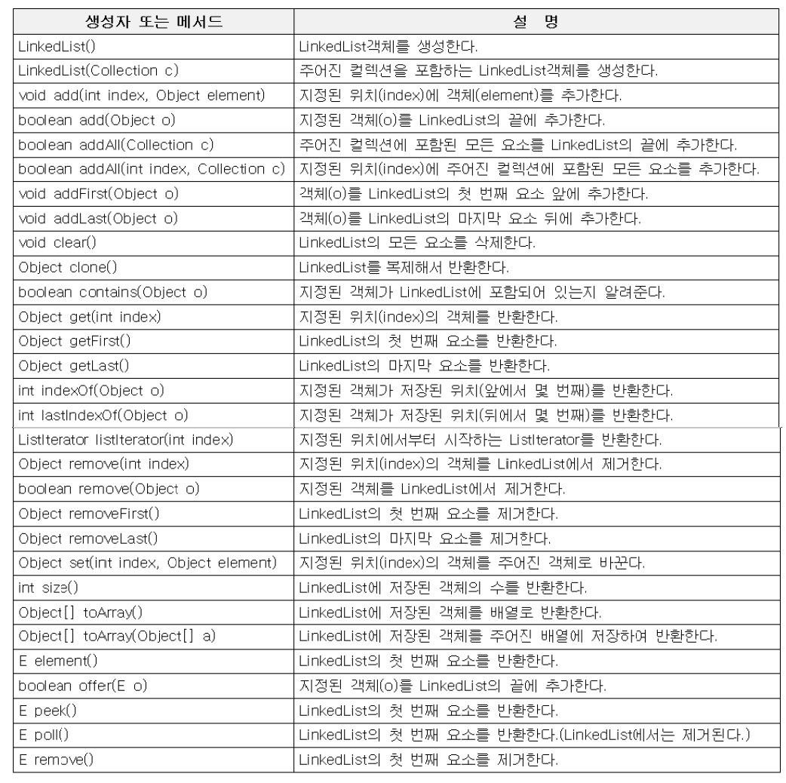

# ArrayList vs. LinkedList
1. 순차적으로 데이터를 추가/삭제하는 경우, ArrayList가 빠르다. 
2. 비순차적으로 데이터를 추가/삭제하는 경우, LinkedList가 빠르다. 
3. 접근시간(access time)은 ArrayList가 빠르다.
 
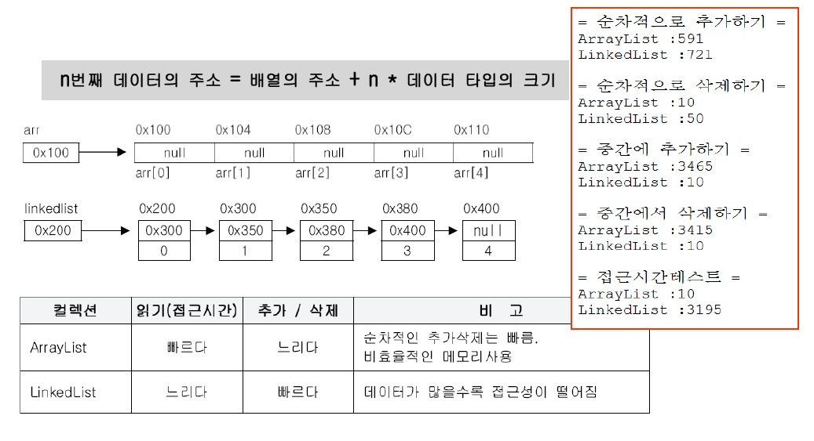

# 스택과 큐(Stack & Queue)
1. 스택(Stack) : LIFO구조. 마지막에 저장된 것을 제일 먼저 꺼내게 된다.
<br> - 수식계산, 수식괄호검사, undo/redo, 뒤로/앞으로(웹브라우져)
2. 큐(Queue) : FIFO구조. 제일 먼저 저장한 것을 제일 먼저 꺼내게 된다. 
<br> - 최근 사용문서, 인쇄작업대기목록, 버퍼(buffer)

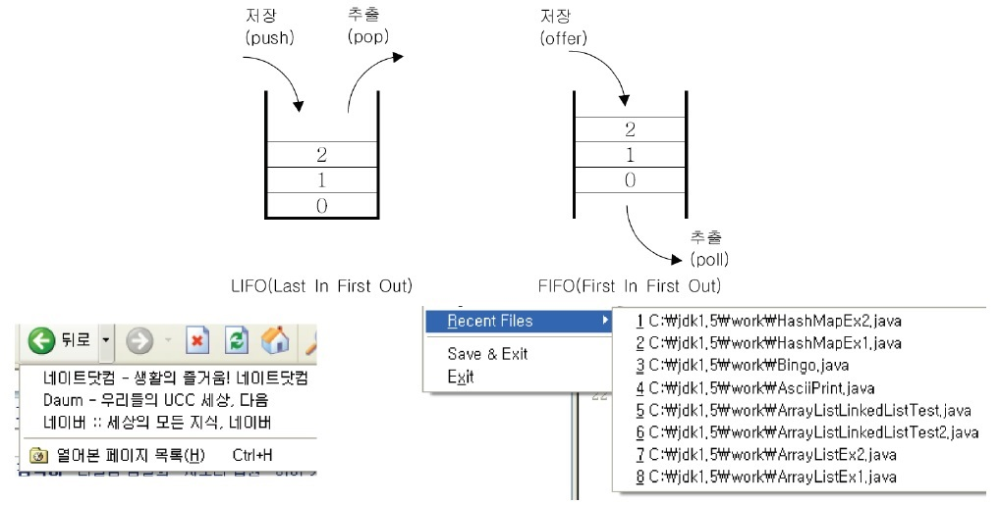

# Enumeration, Iterator, ListIterator
1. 컬렉션 클래스에 저장된 데이터를 접근하는데 사용되는 인터페이스이다.
2. Enumeration는 Iterator의 구버젼이다.
3. Iterator의 접근성을 향상시킨 것이 ListIterator이다.(단방향 → 양방향)

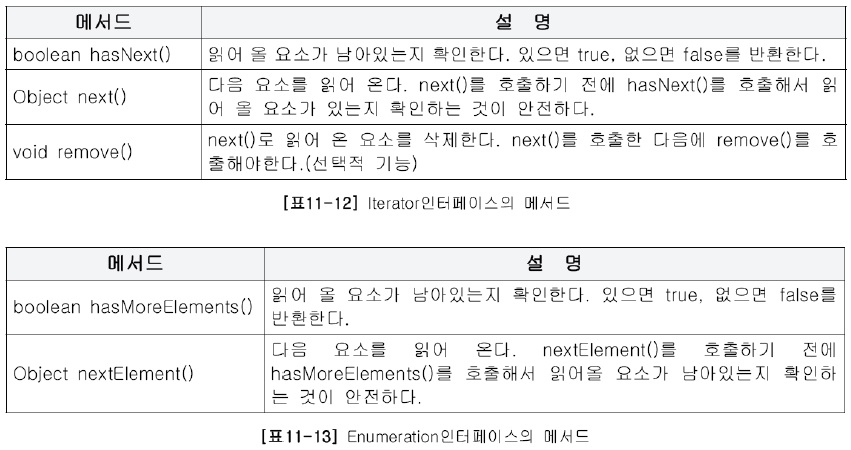

# Iterator
1. 컬렉션 클래스에 저장된 요소들을 나열하는 방법을 제공.
2. 컬렉션 클래스의 iterator()를 호출해서 Iterator를 구현한 객체를 얻는다.

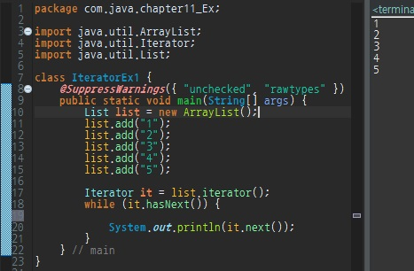

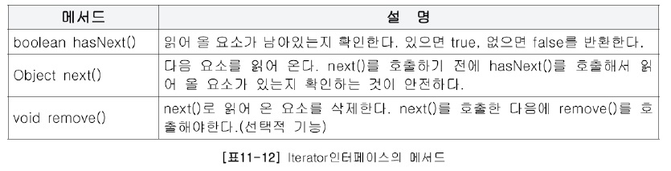

# ListIterator - Iterator의 기능을 확장(상속) 
1. Iterator의 접근성을 향상시킨 것이 ListIterator이다.(단방향 →양방향) 
2. listIterator()를 통해서 얻을 수 있다.(List를 구현한 컬렉션 클래스에 존재) 

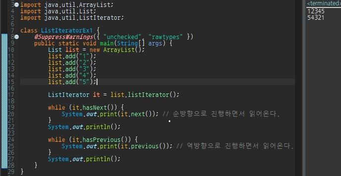

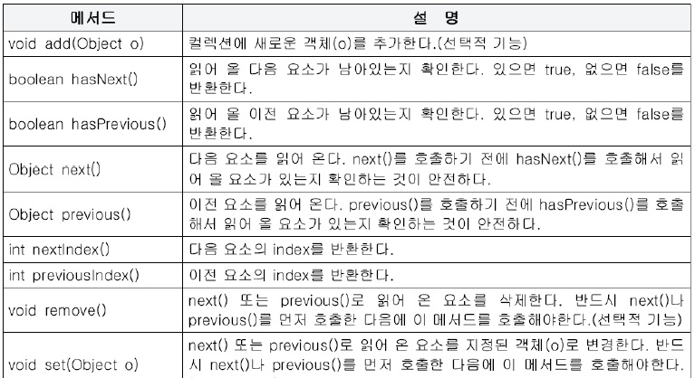

# HashSet (중복허용×, 순서유지×)
1. Set인터페이스를 구현한 대표적인 컬렉션 클래스.(중복허용×, 순서유지×) 
2. 순서를 유지하고자 한다면, LinkedHashSet클래스를 사용해야 한다.
<br> * LinkedHashSet은 JDK1.4부터 추가 되었다.

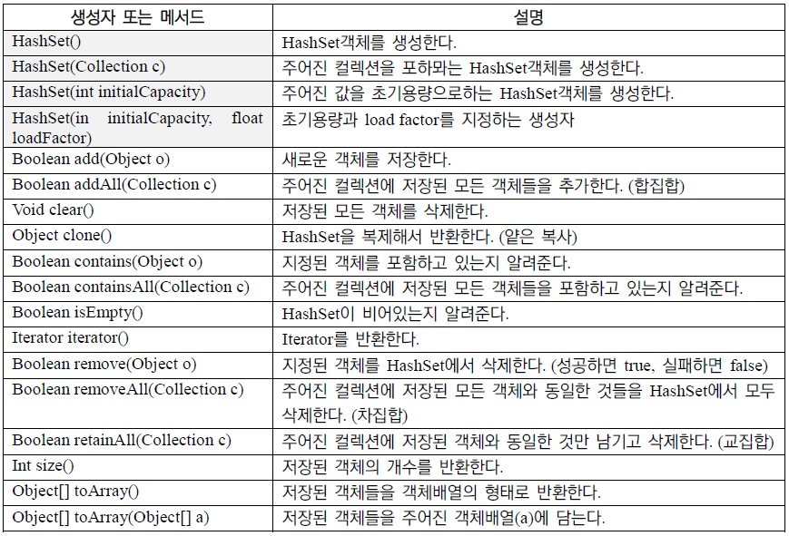

<br> * 중복된 값이 들어가는지 확인하는 예제
<br> - String의 “1”과 Integer의 1은 중복이 아니므로 저장이 된다.
<br> - 중복된 값이 들어갈 경우 false를 반환하고 저장하지 않는다.

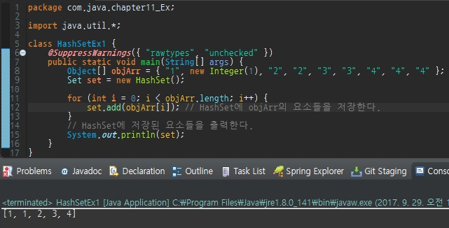

<br> * 중복을 제거하는 동시에 저장한 순서를 유지하고자 한다면 LinkedHashSet

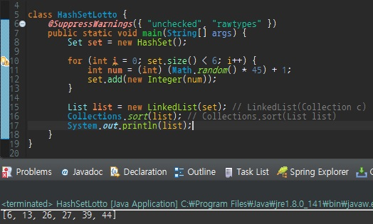

<br> * 서로 다른 인스턴스를 구별하는 방법
<br> - add()메서드는 새로운 요소를 추가하기 전에 기존에 저장된 요소와 같은 것인지 판별하기 위해 
<br> 추가하려는 요소의 equals()와 hashCode()를 호출하기 때문에 equals()와 hashCode()를 목적에 맞게 오버라이딩해야 한다.
<br> - String클래스의 hashCode()도 잘 구현되어 있지만 Objects 클래스의 hash()를 이용하도록 하자.

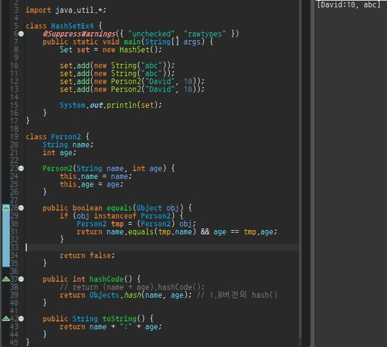

# HashCode()의 세가지 조건
1. 동일 객체에 대해 hashCode()를 여러 번 호출해도 동일한 값을 반환해야 한다.  
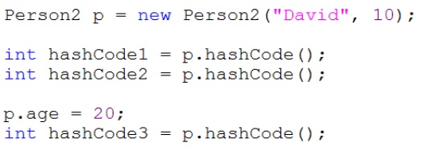  
2. equals()로 비교해서 true를 얻은 두 객체의 hashCode()값은 일치해야 한다.  
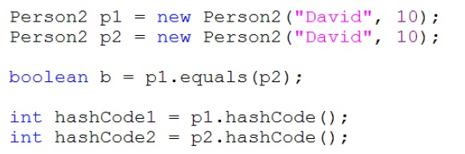  
3. equals()로 비교해서 false를 얻은 두 객체의 hashCode()값은 서로 다른 것이 보통이지만, 같아도 문제없다. 
<br> * 그러나 성능향상을 위해 가능하면 서로 다른 값을 반환하도록 오버라이딩하자.

# TreeSet (검색과 정렬에 유리)
1. Set인터페이스를 구현한 컬렉션 클래스.(중복허용×, 순서유지×, 정렬저장○)
2. 이진검색트리(binary search tree - 정렬, 검색에 유리)의 구조로 되어있다 
3. 링크드리스트와 같이 각 요소(node)가 나무(tree)형태로 연결된 구조
4. 모든 트리는 하나의 루트(root node)를 가지며, 서로 연결된 두 요소를 ‘부모-자식관계’에 있다 하고, 하나의 부모에 최대 두 개의 자식을 갖는다.
5. 왼쪽 자식의 값은 부모의 값보다 작은 값을, 오른쪽 자식의 값은 부모보다 큰 값을 저장한다.
6. 검색과 정렬에 유리하지만, HashSet보다 데이터 추가, 삭제시간이 더 걸린다.

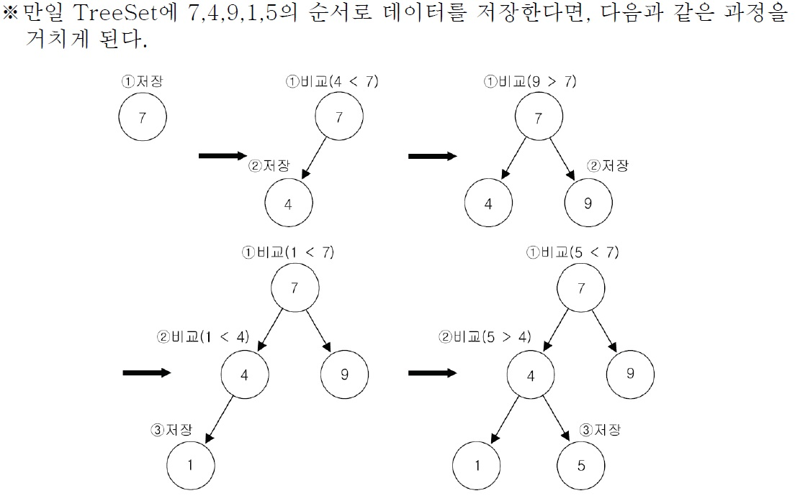

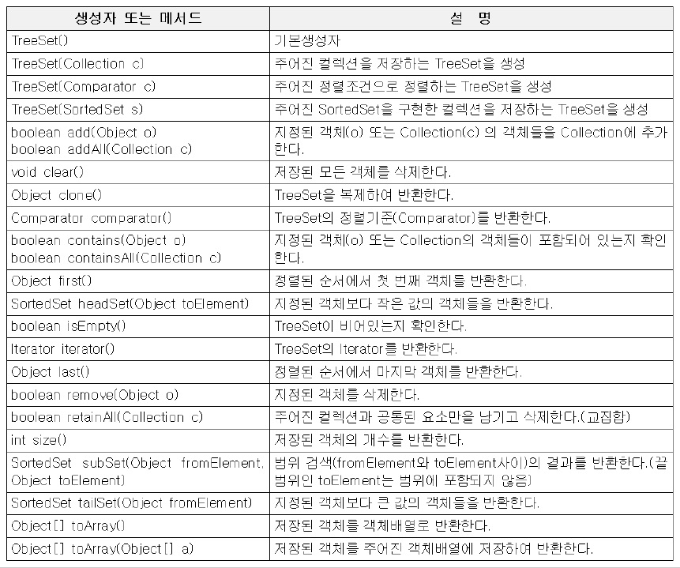

# Comparator와 Comparable
객체를 정렬하는데 필요한 메서드를 정의한 인터페이스이다.
1. Comparable: 기본 정렬기준을 구현하는데 사용.
2. Comparator: 기본 정렬기준 외에 다른 기준으로 정렬하고자할 때 사용.

이 들에 정의된 compare(), compareTo()를 구현함으로써 정렬이 필요한 경우, 
예를 들면 TreeSet이나 sort()를 사용할 때, 정렬기준을 제시하게 된다. 

```java
public interface Comparator {
	int compare(Object o1, Object o2); // o1, o2 두 객체를 비교
	boolean eqals(Object obj)); // equals를 오버라이딩하라는 뜻
}

public interface Comparable {
	int compareTo(Object o); // 주어진 객체(o)를 자신과 비교
}
```
compare()와 compareTo()는 이름과 매개변수의 수만 다를 뿐, 두 객체를 비교해서 같으면 0을 작으면 음수, 크면 양수를 반환한다는 것은 같다.  
 그리고 이 반환값을 통해 두 객체의 정렬순서가 결정된다.   

※ equals메서드는 모든 클래스가 가지고 있지만, Comparator를 구현하는 클래스는 equals메서드의 오버라이딩이 필요할 수도 있다는 것을 알리기 위해 정의한 것일 뿐,  
대부분의 경우 compare(Object o1, Object o2)만 구현하면 된다. 

- 예제

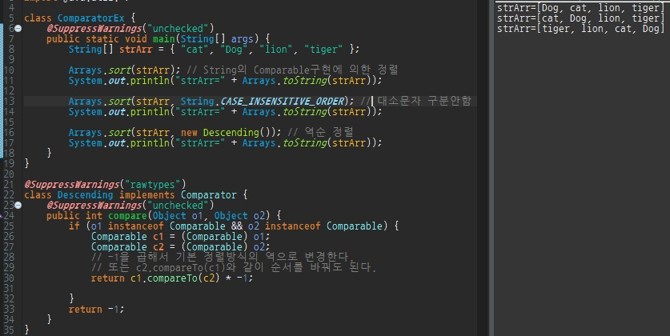

# Hashtable과 HashMap
- HashMap은 Map인터페이스를 구현하였으며, 데이터를 키와 값의 쌍으로 저장한다. 
- HashMap은 Hashtable의 신버젼이며, Hashtable과 달리 HashMap은 동기화처리가 되어 있지 않다. 가능하면 Hashtable보다는 HashMap을 사용해야 한다.
- HashMap은 해싱(hashing)기법을 사용해서 데이터를 저장하기 때문에 많은 양의 데이터를 검색할 때 성능이 뛰어나다.  

키(key): 컬렉션 내의 키(key)중에서 유일해야 한다.  
값(value): 키(key)와 달리 데이터의 중복을 허용한다.

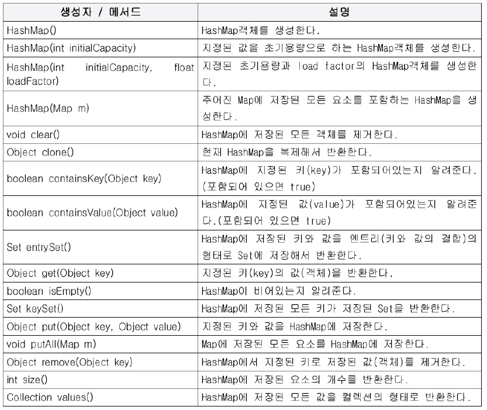

- HashMap의 기본적인 메서드를 이용해서 데이터를 저장하고 읽어오는 예제

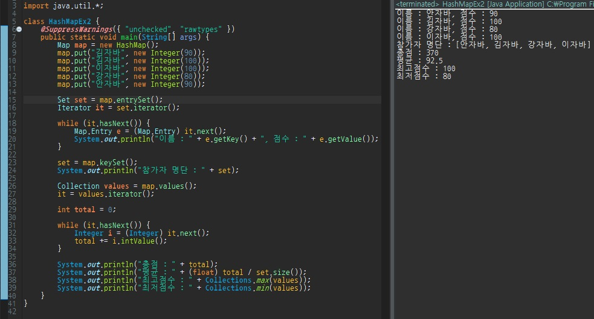

# 해싱 (hashing)